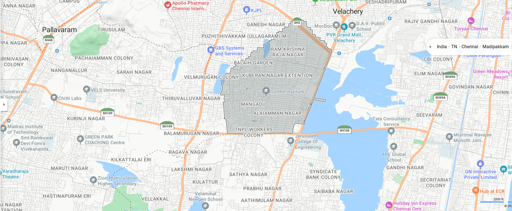
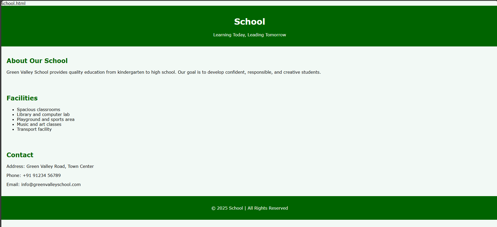
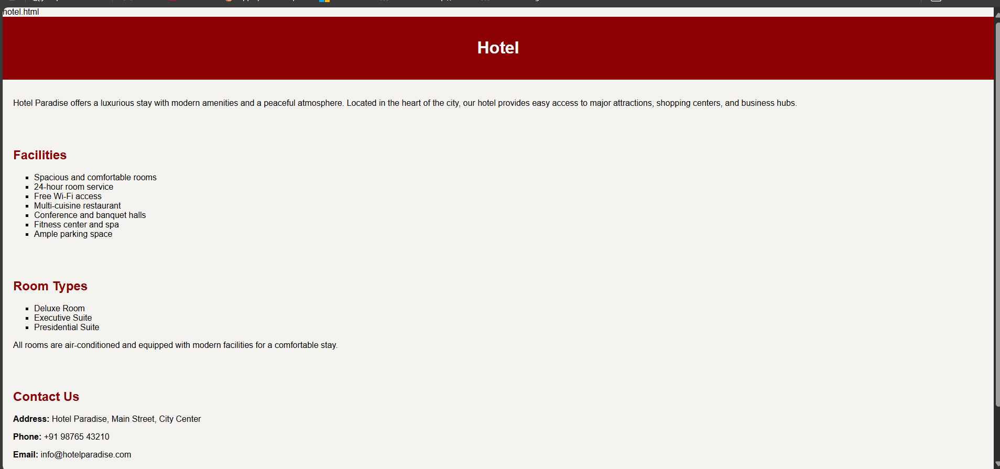
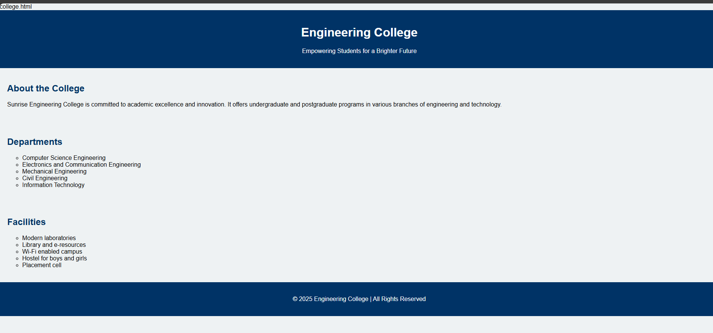
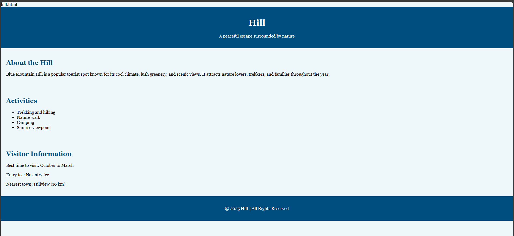
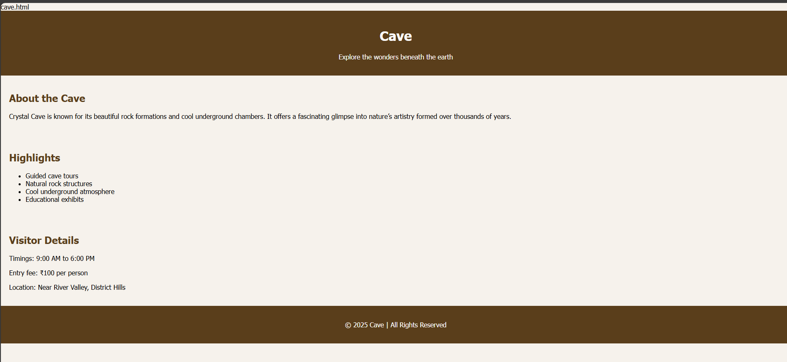

# Ex04 Places Around Me
## Date:07/10/2025 

## AIM
To develop a website to display details about the places around my house.

## DESIGN STEPS

### STEP 1
Create a Django admin interface.

### STEP 2
Download your city map from Google.

### STEP 3
Using ```<map>``` tag name the map.

### STEP 4
Create clickable regions in the image using ```<area>``` tag.

### STEP 5
Write HTML programs for all the regions identified.

### STEP 6
Execute the programs and publish them.

## CODE
'''
map.html

<!DOCTYPE html>
<html lang="en">
    <head>
    </head>
    <body>
        
<map name="image-maps-2023-04-20-084957" id="ImageMapsCom-image-maps-2023-04-20-084957">
<area  alt="" title="Arunachala Hill" href="hill.html" shape="rect" coords="642,370,798,430" style="outline:none;" target="_self"    data-maphilight='aurachala hill' />
<area  alt="" title="cave" href="cave.html" shape="rect" coords="689,489,885,565" style="outline:none;" target="_self"    data-maphilight='cave' />
<area  alt="" title="college" href="college.html" shape="rect" coords="910,725,1046,836" style="outline:none;" target="_self"    data-maphilight='college
' />
<area  alt="" title="hotel" href="hotel.html" shape="rect" coords="982,305,1214,371" style="outline:none;" target="_self"    data-maphilight='hotel' />
<area  alt="" title="school" href="school.html" shape="rect" coords="230,714,470,813" style="outline:none;" target="_self"    data-maphilight='school' />
<area shape="rect" coords="1918,972,1920,974" alt="Image Map" style="outline:none;" title="Image Map" href="https://www.image-maps.com/" />
</map>
    </body>
</html>

hill.html

<!DOCTYPE html>
<html>
<head>
    <title>Blue Mountain Hill</title>
    <meta charset="UTF-8">
    <meta name="viewport" content="width=device-width, initial-scale=1.0">
    <style>
        body {font-family: Georgia; background-color: #eef7fa; margin: 0;}
        header, footer {background-color: #004d80; color: white; text-align: center; padding: 20px;}
        section {padding: 20px;}
        h2 {color: #004d80;}
    </style>
</head>
<body>
<header>
    <h1>Hill</h1>
    <p>A peaceful escape surrounded by nature</p>
</header>

<section>
    <h2>About the Hill</h2>
    <p>Blue Mountain Hill is a popular tourist spot known for its cool climate, lush greenery, and scenic views. 
    It attracts nature lovers, trekkers, and families throughout the year.</p>
</section>

<section>
    <h2>Activities</h2>
    <ul>
        <li>Trekking and hiking</li>
        <li>Nature walk</li>
        <li>Camping</li>
        <li>Sunrise viewpoint</li>
    </ul>
</section>

<section>
    <h2>Visitor Information</h2>
    <p>Best time to visit: October to March</p>
    <p>Entry fee: No entry fee</p>
    <p>Nearest town: Hillview (10 km)</p>
</section>

<footer>
    <p>© 2025 Hill | All Rights Reserved</p>
</footer>
</body>
</html>

cave.html

<!DOCTYPE html>
<html>
<head>
    <title>Crystal Cave</title>
    <meta charset="UTF-8">
    <meta name="viewport" content="width=device-width, initial-scale=1.0">
    <style>
        body {font-family: Tahoma; background-color: #f6f2ec; margin: 0;}
        header, footer {background-color: #5a3e1b; color: white; text-align: center; padding: 20px;}
        section {padding: 20px;}
        h2 {color: #5a3e1b;}
    </style>
</head>
<body>
<header>
    <h1>Cave</h1>
    <p>Explore the wonders beneath the earth</p>
</header>

<section>
    <h2>About the Cave</h2>
    <p>Crystal Cave is known for its beautiful rock formations and cool underground chambers. 
    It offers a fascinating glimpse into nature’s artistry formed over thousands of years.</p>
</section>

<section>
    <h2>Highlights</h2>
    <ul>
        <li>Guided cave tours</li>
        <li>Natural rock structures</li>
        <li>Cool underground atmosphere</li>
        <li>Educational exhibits</li>
    </ul>
</section>

<section>
    <h2>Visitor Details</h2>
    <p>Timings: 9:00 AM to 6:00 PM</p>
    <p>Entry fee: ₹100 per person</p>
    <p>Location: Near River Valley, District Hills</p>
</section>

<footer>
    <p>© 2025 Cave | All Rights Reserved</p>
</footer>
</body>
</html>

college.html


<!DOCTYPE html>
<html>
<head>
    <title>Sunrise Engineering College</title>
    <meta charset="UTF-8">
    <meta name="viewport" content="width=device-width, initial-scale=1.0">
    <style>
        body {font-family: Arial; background-color: #eef2f3; margin: 0;}
        header, footer {background-color: #003366; color: white; text-align: center; padding: 20px;}
        section {padding: 20px;}
        h2 {color: #003366;}
        ul {list-style-type: circle;}
    </style>
</head>
<body>
<header>
    <h1>Engineering College</h1>
    <p>Empowering Students for a Brighter Future</p>
</header>

<section>
    <h2>About the College</h2>
    <p>Sunrise Engineering College is committed to academic excellence and innovation. 
    It offers undergraduate and postgraduate programs in various branches of engineering and technology.</p>
</section>

<section>
    <h2>Departments</h2>
    <ul>
        <li>Computer Science Engineering</li>
        <li>Electronics and Communication Engineering</li>
        <li>Mechanical Engineering</li>
        <li>Civil Engineering</li>
        <li>Information Technology</li>
    </ul>
</section>

<section>
    <h2>Facilities</h2>
    <ul>
        <li>Modern laboratories</li>
        <li>Library and e-resources</li>
        <li>Wi-Fi enabled campus</li>
        <li>Hostel for boys and girls</li>
        <li>Placement cell</li>
    </ul>
</section>

<footer>
    <p>© 2025 Engineering College | All Rights Reserved</p>
</footer>
</body>
</html>

hotel.html

<!DOCTYPE html>
<html>
<head>
    <title>Hotel Paradise</title>
    <meta charset="UTF-8">
    <meta name="viewport" content="width=device-width, initial-scale=1.0">
    <style>
        body {
            font-family: Arial, sans-serif;
            background-color: #f5f3ef;
            margin: 0;
            padding: 0;
        }
        header {
            background-color: #8b0000;
            color: white;
            text-align: center;
            padding: 20px;
        }
        section {
            padding: 20px;
        }
        h2 {
            color: #8b0000;
        }
        footer {
            background-color: #8b0000;
            color: white;
            text-align: center;
            padding: 10px;
            margin-top: 30px;
        }
        ul {
            list-style-type: square;
        }
    </style>
</head>
<body>

    <header>
        <h1> Hotel </h1>
       
    </header>

    <section>
        
        <p>Hotel Paradise offers a luxurious stay with modern amenities and a peaceful atmosphere. 
        Located in the heart of the city, our hotel provides easy access to major attractions, 
        shopping centers, and business hubs.</p>
    </section>

    <section>
        <h2>Facilities</h2>
        <ul>
            <li>Spacious and comfortable rooms</li>
            <li>24-hour room service</li>
            <li>Free Wi-Fi access</li>
            <li>Multi-cuisine restaurant</li>
            <li>Conference and banquet halls</li>
            <li>Fitness center and spa</li>
            <li>Ample parking space</li>
        </ul>
    </section>

    <section>
        <h2>Room Types</h2>
        <ul>
            <li>Deluxe Room</li>
            <li>Executive Suite</li>
            <li>Presidential Suite</li>
        </ul>
        <p>All rooms are air-conditioned and equipped with modern facilities for a comfortable stay.</p>
    </section>

    <section>
        <h2>Contact Us</h2>
        <p><strong>Address:</strong> Hotel Paradise, Main Street, City Center</p>
        <p><strong>Phone:</strong> +91 98765 43210</p>
        <p><strong>Email:</strong> info@hotelparadise.com</p>
    </section>

    <footer>
        <p>© 2025 Hotel Paradise | All Rights Reserved</p>
    </footer>

</body>
</html>

school.html

<!DOCTYPE html>
<html>
<head>
    <title>Green Valley School</title>
    <meta charset="UTF-8">
    <meta name="viewport" content="width=device-width, initial-scale=1.0">
    <style>
        body {font-family: Verdana; background-color: #f2f9f5; margin: 0;}
        header, footer {background-color: #006400; color: white; text-align: center; padding: 20px;}
        section {padding: 20px;}
        h2 {color: #006400;}
        ul {list-style-type: disc;}
    </style>
</head>
<body>
<header>
    <h1> School</h1>
    <p>Learning Today, Leading Tomorrow</p>
</header>

<section>
    <h2>About Our School</h2>
    <p>Green Valley School provides quality education from kindergarten to high school. 
    Our goal is to develop confident, responsible, and creative students.</p>
</section>

<section>
    <h2>Facilities</h2>
    <ul>
        <li>Spacious classrooms</li>
        <li>Library and computer lab</li>
        <li>Playground and sports area</li>
        <li>Music and art classes</li>
        <li>Transport facility</li>
    </ul>
</section>

<section>
    <h2>Contact</h2>
    <p>Address: Green Valley Road, Town Center</p>
    <p>Phone: +91 91234 56789</p>
    <p>Email: info@greenvalleyschool.com</p>
</section>

<footer>
    <p>© 2025 School | All Rights Reserved</p>
</footer>
</body>
</html>

'''

## OUTPUT








## RESULT
The program for implementing image maps using HTML is executed successfully.
